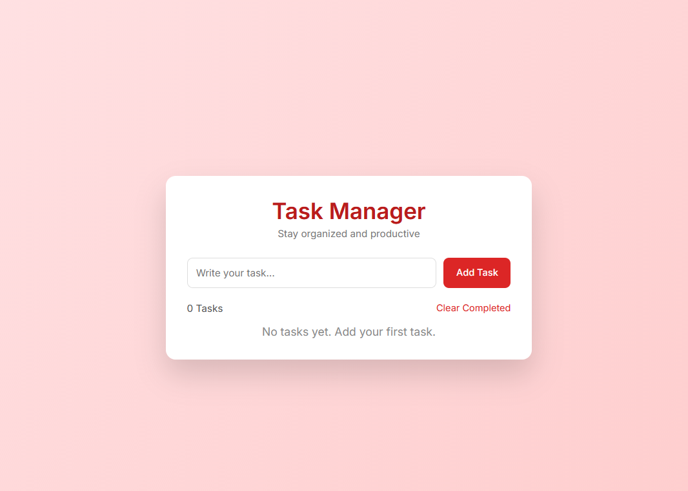

# 📝 Todo App

A simple and responsive **Todo App** built using **HTML, CSS, and JavaScript** that helps users manage their daily tasks efficiently. The app allows users to add, complete, and delete tasks through an intuitive and user-friendly interface.

---

## 🚀 Features

- ➕ Add new tasks
- ✅ Mark tasks as completed
- 🗑️ Delete tasks
- 📱 Responsive design
- ⚡ Fast and lightweight
- 🎯 Built with vanilla JavaScript (no frameworks)

---

## 🛠️ Tech Stack

- **HTML5** – Structure of the application  
- **CSS3** – Styling and layout  
- **JavaScript (ES6)** – Functionality and DOM manipulation  

---

## 📂 Project Structure

```
todo-app/
│
├── index.html
├── style.css
├── script.js
└── README.md
```

---

## 📸 Screenshots


```

```

---

## ⚙️ How to Run the Project

1. Clone the repository

```
git clone https://github.com/your-username/todo-app.git
```

2. Navigate to the project folder

```
cd todo-app
```

3. Open `index.html` in your browser.

---

## 🌐 Live Demo

If deployed, add your live link here:

```
https://your-live-demo-link.com
```

---

## 🎯 Learning Purpose

This project was built to practice:

- JavaScript DOM manipulation
- Event handling
- Basic frontend development
- Building interactive web applications

---

## 🤝 Contributing

Contributions are welcome. Feel free to fork the repository and submit a pull request.

---

## 📄 License

This project is open source and available under the **MIT License**.

---

⭐ If you like this project, consider giving it a **star** on GitHub!
